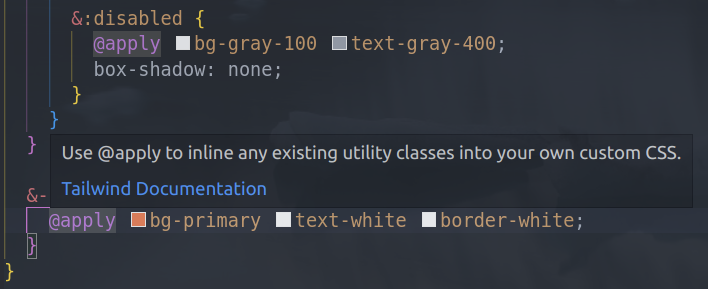

# Tailwind CSS directives

## Description

This VSCode extension adds support for Tailwind CSS directives. By default @tailwind, @apply, @layer, etc... are not recognized by the CSS language server. This extension include a custom data file that loads them inside your CSS & SCSS files. It will also show a description and a link to the documentation when you hover over a directive.



⚠️ Support Tailwind CSS v3 and also v2 (included alongside v3)

Documentation about custom data can be found here: https://github.com/microsoft/vscode-css-languageservice/blob/main/docs/customData.md

Based on rules from this issue: https://github.com/tailwindlabs/tailwindcss-intellisense/issues/69

## Installation

1. The easiest and recommended way is simply to install this extension from the VSCode marketplace.

2. You can also copy the `tailwind.css-data.json` file into your project root and add the following to your `settings.json` file:

```json
"css.customData": [
  "./tailwind.css-data.json"
]
```

(you can also put it inside a `.vscode` folder and set the path to `./.vscode/tailwind.css-data.json`)

3. The last option is to run this extension in the **Debug** tab and select the **Launch Extension** configuration. This will open a new VSCode window with the extension installed.

## Contributing

If you want to contribute to this project, you can do so by forking the repository and submitting a pull request.

I will check sometimes if TailwindCSS has added new directives in the documentation but it shouldn't change that often. Probably just update the documentation sometimes.
